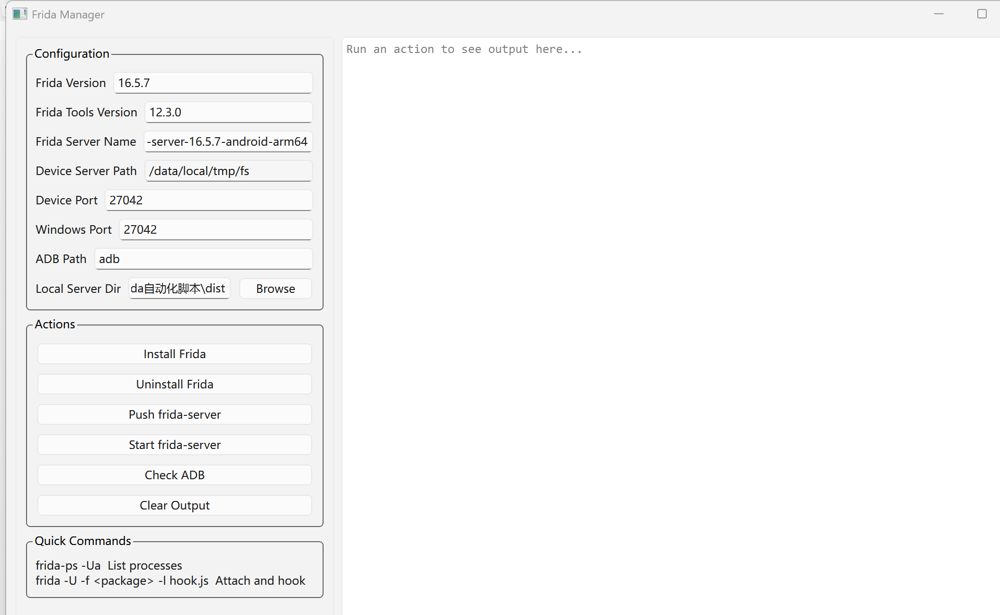

# Frida Manager

一个专为移动安全测试人员设计的 Windows 桌面工具，帮助你快速管理 Frida 工具链、推送 frida-server、启动服务与端口转发。

## 下载地址

前往 [Releases](https://github.com/yourname/frida-manager/releases) 下载最新版本的 `FridaManager.exe`。

## 功能特性

- **一键安装/卸载**：快速在电脑上安装或卸载 Frida、Frida-tools、frida-dexdump
- **推送 frida-server**：将指定版本的 frida-server 推送到 Android 设备
- **启动服务**：在设备上启动 frida-server 并自动完成端口转发
- **ADB 设备管理**：查看连接设备状态，支持 USB/无线连接
- **日志输出**：实时显示操作日志，支持复制与保存
- **CLI 模式**：支持命令行交互（运行 `FridaManager.exe --cli`）

## 界面预览

## 快速开始

1. **下载 EXE**：从 Releases 下载最新版 FridaManager.exe
2. **运行程序**：双击 exe 文件启动 GUI
3. **连接设备**：确保 Android 设备已开启 USB 调试并连接电脑
4. **开始使用**：配置参数后点击相应按钮完成操作

## 环境要求

- Windows 10/11
- ADB（Android Debug Bridge）已安装并在 PATH 中，或在设置中手动指定路径
- Python以及Python\Scripts文件夹的环境变量已配置

## 配置说明

| 配置项 | 说明 | 默认值 |
|--------|------|--------|
| Frida Version | Frida 版本号 | 16.5.7 |
| Frida Tools Version | Frida-tools 版本号 | 12.3.0 |
| Frida Server Name | frida-server 文件名 | frida-server-16.5.7-android-arm64 |
| Device Server Path | 设备端推送路径 | /data/local/tmp/fs |
| Device Port | 设备端端口 | 27042 |
| Windows Port | Windows 端端口 | 27042 |
| ADB Path | ADB 可执行文件路径 | adb（不要动它！保持默认值就行） |
| Local Server Dir | 本地 frida-server 所在目录 | 当前目录 |

## 使用流程

1. **检查 ADB**：确保设备已连接，`ADB Path` 正确
2. **安装 Frida**：点击「安装 Frida」在电脑上安装依赖
3. **选择 frida-server**：点击「浏览」选择本地 `frida-server` 文件
4. **推送**：点击「推送 frida-server」将文件推送到手机
5. **启动**：点击「启动 frida-server」启动服务并转发端口

## 常见问题

**Q: 推送失败，提示 "Local frida-server not found"**
A: 检查 `Local Server Dir` 和 `Frida Server Name` 是否正确指向本地存在的文件。

如问题持续请提交 Issue。

## 许可证

MIT License

---

By 邻家小明
